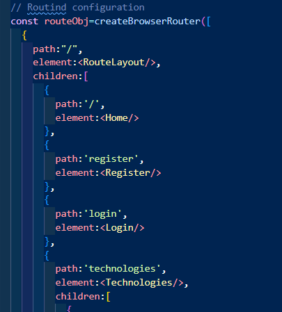

To add routing in the application:
    
1) Designing the route layout.

2) Install react router module:
    -npm install react-router

3) Create the components.
    -Header,Footer
    -Route components

4) Configure the routing for the routing components. Connection components using routing path.
    -Create this in App.jsx (can use main.jsx also but..)
    -import {createBrowserRouter, RouterProvider} from 'react-router'
    
    

-> Routing is done by nesting the routes inside the url path.
